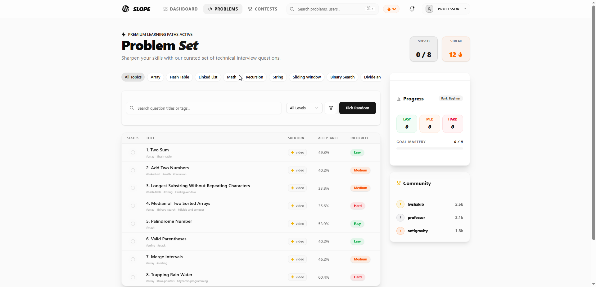
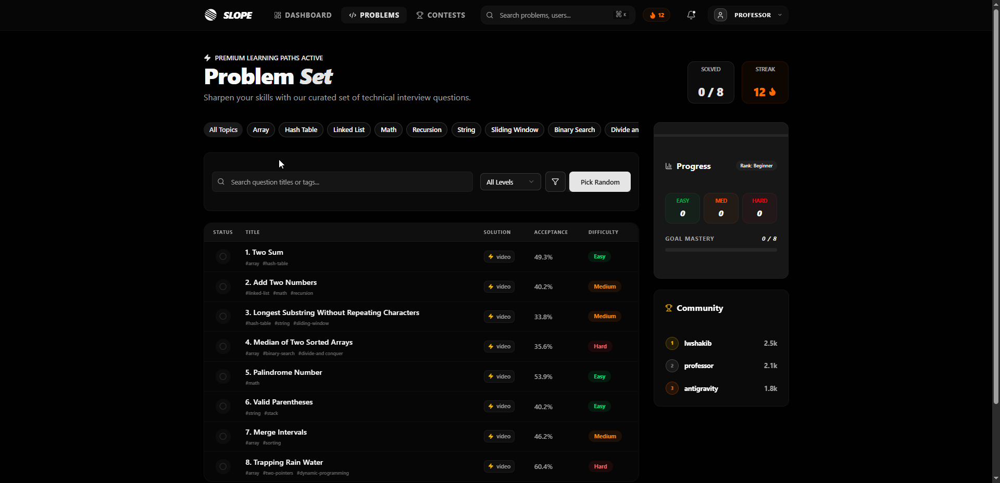
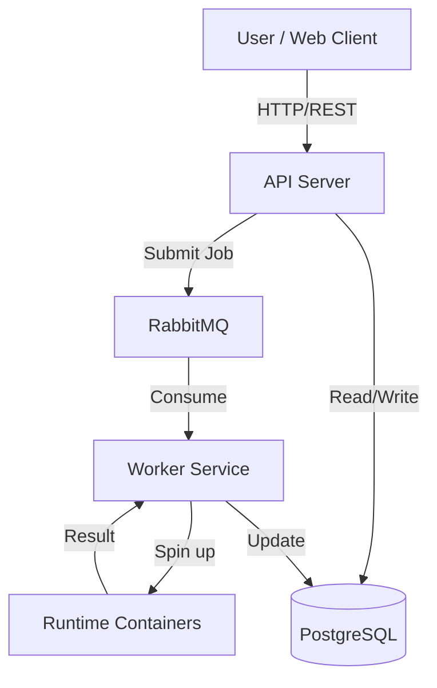

# 🏔️ Slope - Distributed Coding Challenges Platform

[](https://github.com/lwshakib)
[](https://opensource.org/licenses/MIT)

**Slope** is a modern, high-performance platform for mastering algorithms and data structures. It combines a beautiful, developer-centric frontend with a robust, distributed backend capable of securely executing code in multiple languages.

<br />

<div align="center">
  
  &nbsp;
  
</div>

<br />

---

## 🏗️ System Architecture

Slope is built as a distributed system to ensure scalability and security:



### Core Components

1.  **[Slope Web (`/slope-web`)](./slope-web/README.md)**: The Next.js frontend. Features a rich IDE, dashboards, and detailed analytics.
2.  **[Slope Server (`/server`)](./server/README.md)**: The Node.js/Bun backend. Handles auth, problem management, and acts as the API gateway.
3.  **Workers & Runtimes (`/containers`)**:
    -   **Worker System**: Consumes submission jobs from RabbitMQ.
    -   **[Javascript Runtime](./containers/javascript-runtime/README.md)**: Isolated Docker environment for JS execution.
    -   **[Python Runtime](./containers/python-runtime/README.md)**: Isolated Docker environment for Python execution.
    -   **[C++ Runtime](./containers/cpp-runtime/README.md)**: Isolated Docker environment for C++ compilation and execution.

---

## 🛠️ Technology Stack

-   **Frontend**: Next.js 16, Tailwind CSS v4, Shadcn/UI, Zustand.
-   **Backend**: Bun, Express.js, Prisma ORM.
-   **Infrastructure**: Docker, RabbitMQ, PostgreSQL.
-   **Languages Supported**: JavaScript, Python, C++.

---

## 🚀 Getting Started

### Prerequisites

-   [Docker](https://www.docker.com/) & Docker Compose
-   [Bun](https://bun.sh/) (v1.0+)

### 1. Clone the Repository

```bash
git clone https://github.com/lwshakib/slope-coding-challenges.git
cd slope-coding-challenges
```

### 2. Start Infrastructure Services

Use Docker Compose to spin up the database and message queue.

```bash
docker-compose up -d postgres rabbitmq
```

### 3. Setup the Server

Navigate to the server directory, install dependencies, and migrate the database.

```bash
cd server
bun install
cp .env.example .env # Configure your DB/RabbitMQ creds
bun run db:migrate

bun dev
```

### 4. Setup the Frontend

In a new terminal, navigate to the web client directory.

```bash
cd slope-web
bun install
bun dev
```

Access the app at `http://localhost:3000`.

---

## 🤝 Contributing

We welcome contributions! Please read our [Contributing Guide](CONTRIBUTING.md) to learn about our development process, how to propose bugfixes and improvements, and how to build the runtimes locally.

## 📜 License

This project is licensed under the MIT License - see the [LICENSE](LICENSE) file for details.

## 👨‍💻 Author

**lwshakib**

-   GitHub: [@lwshakib](https://github.com/lwshakib)

---

> "Smooth progress on the steepest slopes." 🏔️