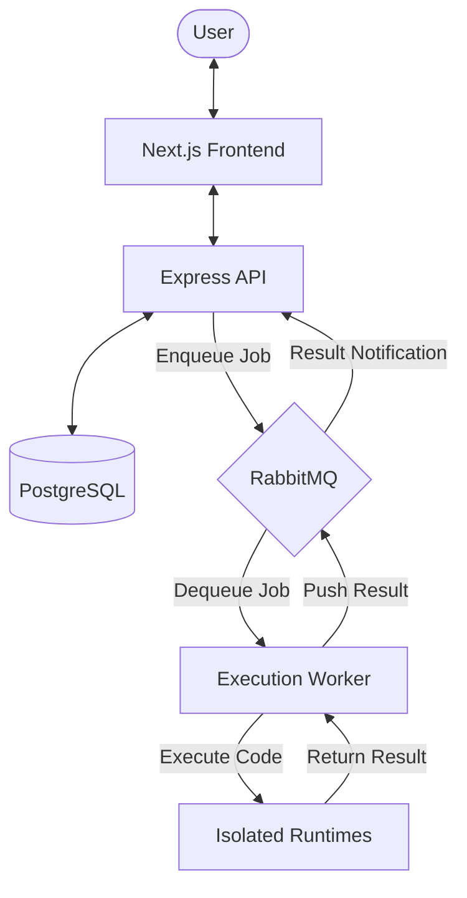
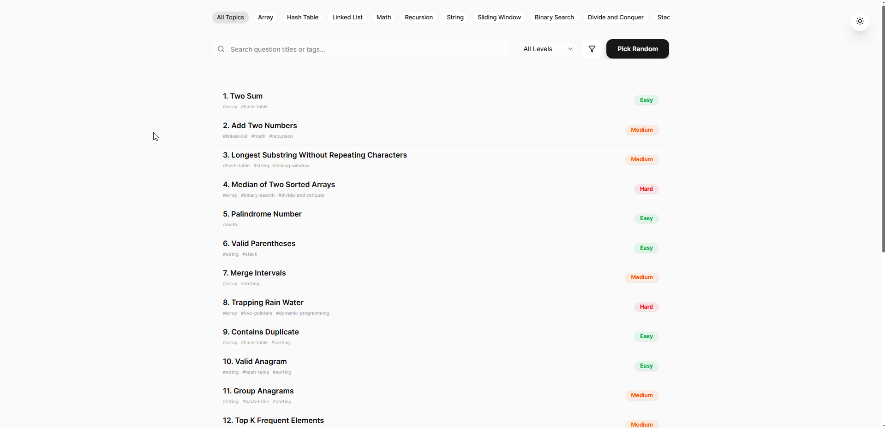
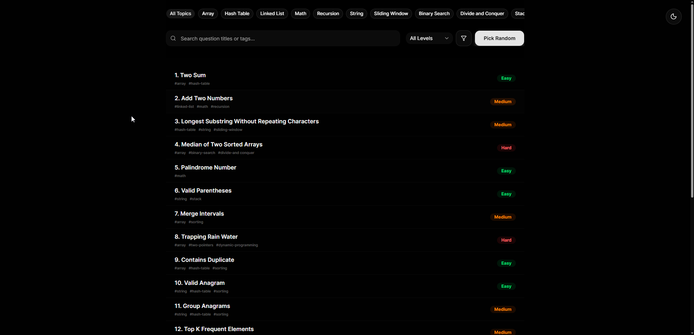
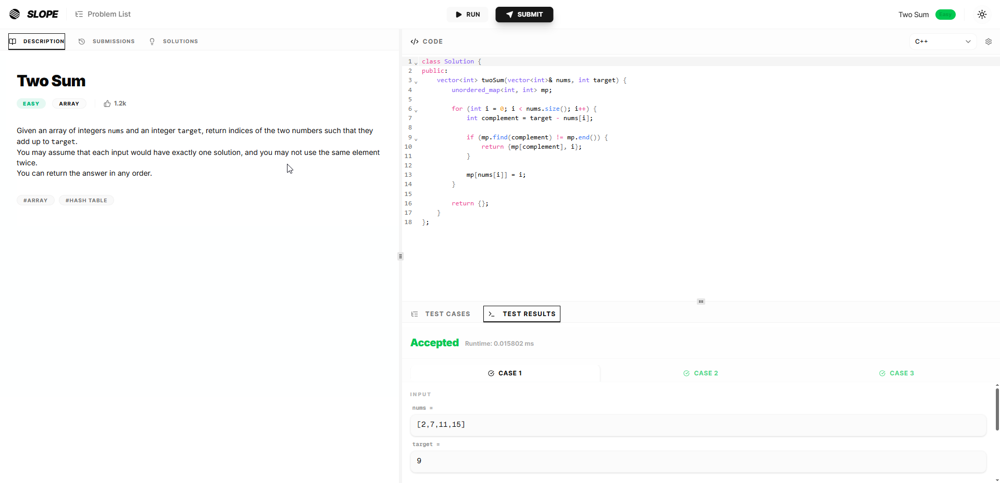
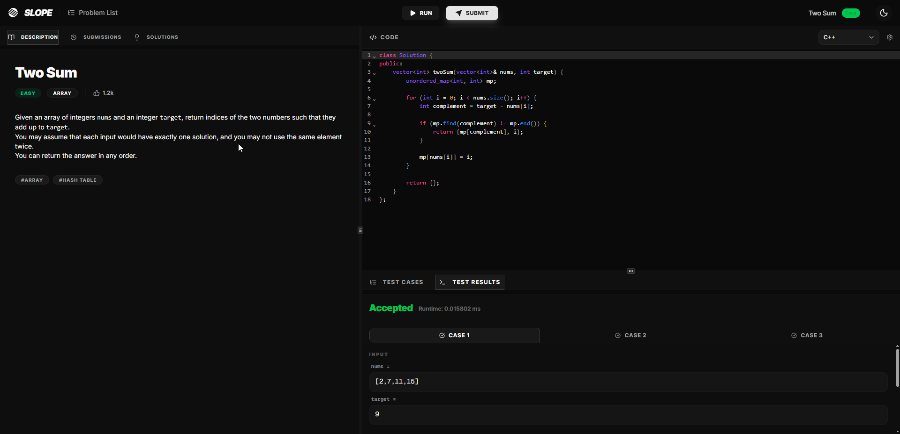
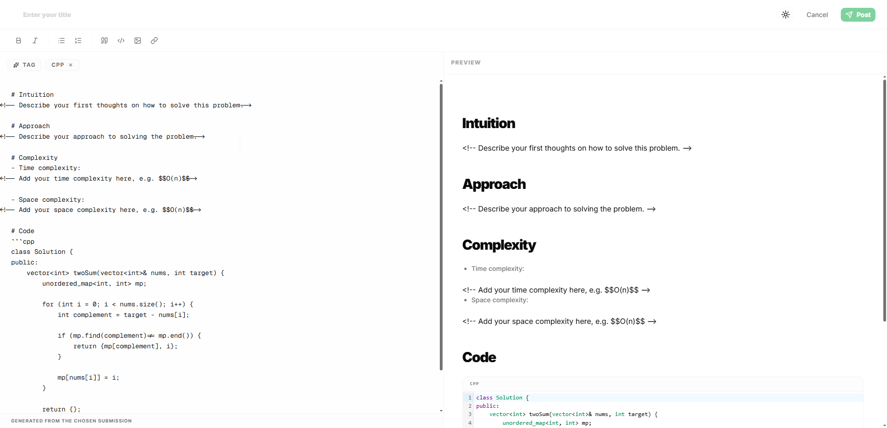
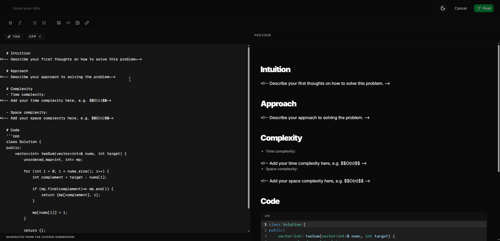

<p align="center">
  
</p>

# Slope Coding Challenges

Slope Coding Challenges is a high-performance, full-stack platform designed for solving algorithmic problems, similar to LeetCode. It features a modern Next.js frontend, a robust Express backend, and an asynchronous code execution worker powered by RabbitMQ.

## 🚀 Features

- **Problem Registry**: 50+ pre-defined algorithmic problems covering various data structures and algorithms.
- **Interactive Code Editor**: Real-time code editing with syntax highlighting (C++, Python, JavaScript).
- **Asynchronous Execution**: Reliable code execution using RabbitMQ and dedicated workers.
- **Modern UI**: Sleek, responsive design built with shadcn/ui and TailwindCSS.
- **Monorepo Architecture**: Clean separation of concerns using Turborepo and pnpm workspaces.

## 🏗️ System Architecture


```mermaid
graph TD
    User([User]) <--> Web[Next.js Frontend]
    Web <--> API[Express API]
    API <--> DB[(PostgreSQL)]
    API -- Enqueue Job --> MQ{RabbitMQ}
    MQ -- Dequeue Job --> Worker[Execution Worker]
    Worker -- Execute Code --> Runtimes[Isolated Runtimes]
    Runtimes -- Return Result --> Worker
    Worker -- Push Result --> MQ
    MQ -- Result Notification --> API
```

## 🛠️ Tech Stack

- **Frontend**: [Next.js](https://nextjs.org/), [React](https://reactjs.org/), [TailwindCSS](https://tailwindcss.com/), [shadcn/ui](https://ui.shadcn.com/)
- **Backend**: [Node.js](https://nodejs.org/), [Express](https://expressjs.com/), [TypeScript](https://www.typescriptlang.org/)
- **Database**: [PostgreSQL](https://www.postgresql.org/)
- **Message Queue**: [RabbitMQ](https://www.rabbitmq.com/)
- **Monorepo**: [Turborepo](https://turbo.build/), [pnpm](https://pnpm.io/)

## 📦 Project Structure

```text
slope-coding-challenges/
├── apps/
│   ├── server/       # Express API & Code Execution Worker
│   └── web/          # Next.js Frontend
├── packages/
│   ├── ui/           # Shared UI components
│   ├── eslint-config/# Shared ESLint configuration
│   └── typescript-config/ # Shared TypeScript configuration
└── docker-compose.yml# Docker services for local development
```

## 🚦 Getting Started

### Prerequisites

- Node.js (>=20)
- pnpm (>=9)
- Docker & Docker Compose (Required for background infrastructure and secure code runtimes)

### Local Setup (Hybrid Architecture)

Slope uses a hybrid architecture for a premium developer experience. The UI and API run locally for instant feedback, while the database, queue, and runtimes run in Docker.

1. **Clone the repository**:
   ```bash
   git clone https://github.com/your-username/slope-coding-challenges.git
   cd slope-coding-challenges
   ```

2. **Install dependencies**:
   ```bash
   pnpm install
   ```

3. **Configure Environment Variables**:
   - Create a `.env` file in `apps/server` based on `apps/server/.env.example`.
   - Ensure `DATABASE_URL` and `RABBITMQ_URL` are correctly set.

4. **Boot Background Containers (Docker)**:
   This will boot PostgreSQL, RabbitMQ, and the isolated execution workers.
   ```bash
   docker-compose up -d --build
   ```

5. **Start Development Servers (Locally)**:
   ```bash
   pnpm dev
   ```
   - Frontend: [http://localhost:3000](http://localhost:3000)
   - API: [http://localhost:8000](http://localhost:8000)

   *Note: The server automatically initializes the database schema on first startup.*

## 📱 App Demos

<div align="center">
  <table border="0">
    <tr>
      <td></td>
      <td></td>
    </tr>
    <tr>
      <td></td>
      <td></td>
    </tr>
    <tr>
      <td></td>
      <td></td>
    </tr>
  </table>
</div>

## 🤝 Contributing

Contributions are welcome! Please see [CONTRIBUTING.md](CONTRIBUTING.md) for details.

## 📄 License

This project is licensed under the MIT License - see the [LICENSE](LICENSE) file for details.
